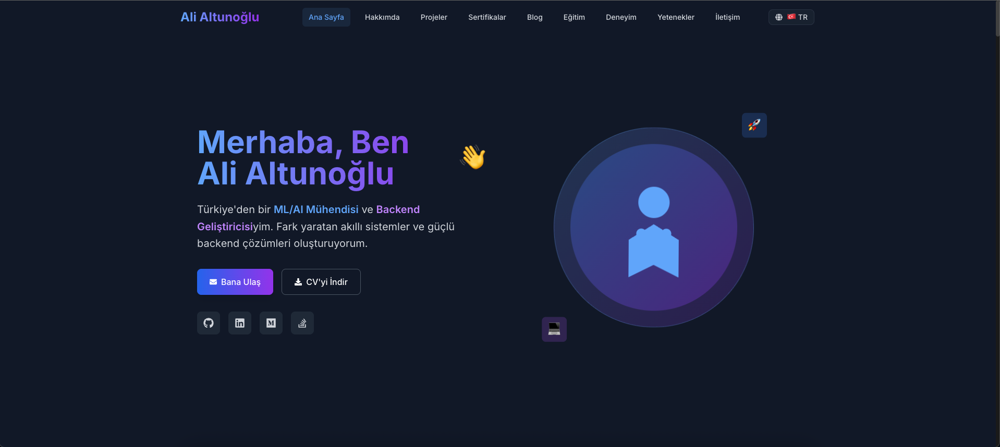
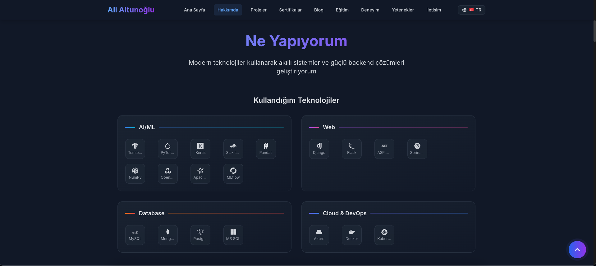
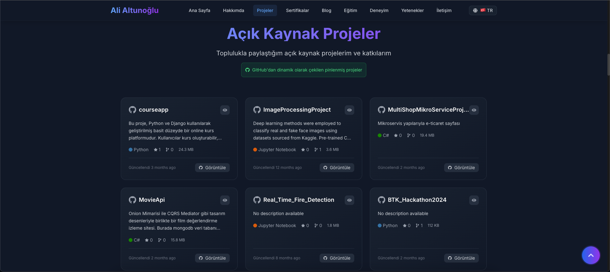
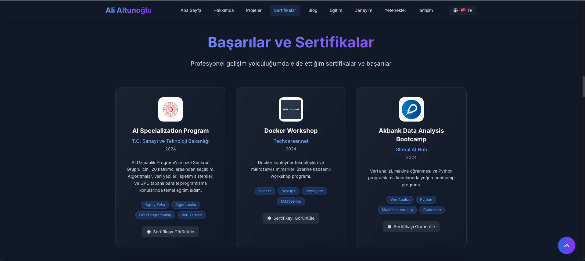

# Ali Altunoğlu - Portfolio Website

Modern ve responsive kişisel portfolio websitesi. React, Tailwind CSS ve Framer Motion ile geliştirilmiştir.

## 🌐 Live Demo
🔗 **[https://alialtunoglu.netlify.app](https://alialtunoglu.netlify.app)** *(yakında)*

## 📸 Uygulama Görselleri

### Ana Sayfa & Hero Section

*Modern hero section ile karşılama, animasyonlu yazılar ve sosyal medya linkler*

### Projeler & Başarılar

*GitHub entegrasyonu ile dinamik projeler ve sertifika başarıları*

### Deneyim & Yetenekler

*Profesyonel deneyim timeline'ı ve interaktif yetenek çubukları*

### İletişim & Responsive Tasarım

*Modern iletişim formu ve tüm cihazlarda mükemmel responsive görünüm*

## 🚀 Özellikler

- **🎨 Modern UI/UX**: Dark theme, gradient renkler ve glassmorphism efektleri
- **🌐 Dinamik GitHub Entegrasyonu**: GitHub API ile pinlenmiş projelerinizi otomatik olarak çeker
- **🌍 Çok Dilli Destek**: Türkçe ve İngilizce dil seçenekleri
- **📱 Tam Responsive**: Tüm cihazlarda mükemmel görünüm
- **⚡ Performant**: Optimized loading ve smooth animations
- **🎭 Interaktif Animasyonlar**: Framer Motion ile akıcı geçişler
- **📧 Çalışan İletişim Formu**: Form doğrulama ve geri bildirim
- **🏆 Sertifika Vitrin**: Başarılar ve sertifikaları görsel olarak sergileme

## 📦 Teknolojiler

- **Frontend**: React 19, Tailwind CSS, Framer Motion
- **Internationalization**: React i18next
- **API**: GitHub GraphQL API
- **Icons**: React Icons
- **Build Tool**: Create React App
- **Deployment**: Netlify

## 🛠️ Kurulum

1. Repository'yi klonlayın:
```bash
git clone https://github.com/alialtunoglu/portfolio.git
cd portfolio
```

2. Bağımlılıkları yükleyin:
```bash
npm install --legacy-peer-deps
```

3. Environment variables oluşturun:
```bash
# .env dosyası oluşturun ve aşağıdaki değerleri ekleyin:
REACT_APP_GITHUB_TOKEN=your_github_token_here
REACT_APP_GITHUB_USERNAME=your_github_username
```

4. Uygulamayı başlatın:
```bash
npm start
```

## 🔧 GitHub Token Oluşturma

1. GitHub Settings > Developer settings > Personal access tokens > Tokens (classic)
2. "Generate new token (classic)" tıklayın
3. Gerekli izinleri verin:
   - `read:user`
   - `repo`
4. Token'ı kopyalayın ve `.env` dosyasına ekleyin

## 📱 Portfolio Bölümleri

### 🏠 Hero Section
- Animated greeting ve tanıtım
- Call-to-action butonları
- Sosyal medya linkeri
- Typing effect animasyonu

### 👨‍💻 About (What I Do)
- Kullandığım teknolojiler
- Sunduğum hizmetler
- Interaktif teknoloji iconları

### 🚀 Projects
- GitHub'dan dinamik proje çekimi
- Star, fork, dil bilgileri
- Fallback static projeler
- Live demo ve GitHub linkeri

### 🏆 Achievements
- Sertifikalar ve başarılar
- Eğitim istatistikleri
- LinkedIn entegrasyonu
- Görsel sertifika kartları

### 📝 Blog
- Medium yazı listesi
- Read time ve stats
- External linkler

### 💼 Experience
- Timeline tasarım
- Şirket logoları
- Detaylı iş tanımları

### 🎯 Skills
- Animated progress bars
- Teknik yetenek grid
- Kategorize edilmiş yetenekler

### 🎓 Education
- Üniversite bilgileri
- GPA ve projeler
- Kurslar listesi

### 📞 Contact
- İletişim bilgileri
- Çalışan contact form
- Sosyal medya linkeri
- Quick response info

## 🌟 Dinamik GitHub Entegrasyonu

Portfolio, GitHub GraphQL API kullanarak pinlenmiş projelerinizi otomatik olarak çeker. GitHub'da pinlediklerinizi değiştirdiğinizde portfolio otomatik olarak güncellenir.

### Avantajlar:
- ✅ Manuel güncelleme gerektirmez
- ✅ Gerçek zamanlı proje bilgileri
- ✅ Star, fork, dil bilgileri otomatik
- ✅ Fallback sistem (API çalışmazsa static veriler)

## 🎨 Kişiselleştirme

### Renkler
`tailwind.config.js` dosyasından tema renklerini değiştirebilirsiniz.

### Çeviriler
`src/i18n/locales/` klasöründen dil dosyalarını düzenleyebilirsiniz.

### Animasyonlar
Framer Motion animasyonları her component'te özelleştirilebilir.

## 📁 Proje Yapısı

```
src/
├── components/          # React componentleri
│   ├── HeroSection.js
│   ├── WhatIDo.js
│   ├── OpenSourceProjects.js
│   ├── Achievements.js
│   ├── Blogs.js
│   ├── Experience.js
│   ├── Skills.js
│   ├── Education.js
│   ├── Contact.js
│   ├── Navbar.js
│   ├── Logo.js
│   └── ScrollToTopButton.js
├── hooks/              # Custom hooks
├── i18n/               # Çeviri dosyaları
├── assets/             # Resim ve diğer assets
├── data/               # Static data dosyaları
└── App.js              # Ana uygulama
```

## 🚀 Deployment

### Netlify (Önerilen)

#### Hızlı Deployment (GitHub'dan):
1. **GitHub'da repository oluşturun ve kodu push edin**
2. **Netlify'e gidin**: [netlify.com](https://netlify.com)
3. **"Add new site" > "Import an existing project"**
4. **GitHub'ı seçin ve repository'nizi bulun**
5. **Build ayarları otomatik gelecek:**
   - Build command: `npm run build`
   - Publish directory: `build`
6. **Environment variables ekleyin** (Site settings > Environment variables):
   ```
   REACT_APP_GITHUB_TOKEN=your_github_token_here
   REACT_APP_GITHUB_USERNAME=your_github_username
   ```
7. **Deploy butonuna tıklayın**

#### Manuel Deployment:
```bash
# 1. Build oluşturun
npm run build

# 2. Netlify'de "Deploy manually" seçin
# 3. build/ klasörünü sürükleyip bırakın
```

#### Custom Domain (Opsiyonel):
1. Netlify Dashboard > Domain settings
2. "Add custom domain" tıklayın
3. Domain'inizi girin ve DNS ayarlarını yapın

### Vercel
```bash
npm run build
# Vercel'e upload edin ve environment variables ekleyin
```

### GitHub Pages
```bash
npm install --save-dev gh-pages
# package.json'a homepage ekleyin
npm run deploy
```

## ⚙️ Environment Variables

Deployment sırasında şu environment variables'ları eklemeyi unutmayın:

```bash
REACT_APP_GITHUB_TOKEN=ghp_xxxxxxxxxxxxxxxxxxxx
REACT_APP_GITHUB_USERNAME=alialtunoglu
```

**GitHub Token Oluşturma:**
1. GitHub Settings > Developer settings > Personal access tokens > Tokens (classic)
2. "Generate new token (classic)" tıklayın
3. İzinler: `read:user`, `repo`
4. Token'ı kopyalayın ve deployment platformuna ekleyin

## 🔒 Güvenlik

- GitHub token'ı `.env` dosyasında saklanır
- `.env` dosyası .gitignore'da yer alır
- Production'da environment variables kullanın

## 🤝 Katkıda Bulunma

1. Fork edin
2. Feature branch oluşturun (`git checkout -b feature/amazing-feature`)
3. Commit edin (`git commit -m 'Add amazing feature'`)
4. Push edin (`git push origin feature/amazing-feature`)
5. Pull Request oluşturun

## 📄 Lisans

Bu proje MIT lisansı altında lisanslanmıştır.

## 👨‍💻 Geliştirici

**Ali Altunoğlu**
- 🌐 Website: [Portfolio](https://alialtunoglu-portfolio.netlify.app)
- 💼 GitHub: [@alialtunoglu](https://github.com/alialtunoglu)
- 💼 LinkedIn: [Ali Altunoğlu](https://linkedin.com/in/alialtunoglu)
- 📝 Medium: [@alialtunoglu](https://medium.com/@alialtunoglu)
- 📧 Email: alialtunoglu.dev@gmail.com

---

⭐ Bu projeyi beğendiyseniz star vererek destek olabilirsiniz!
